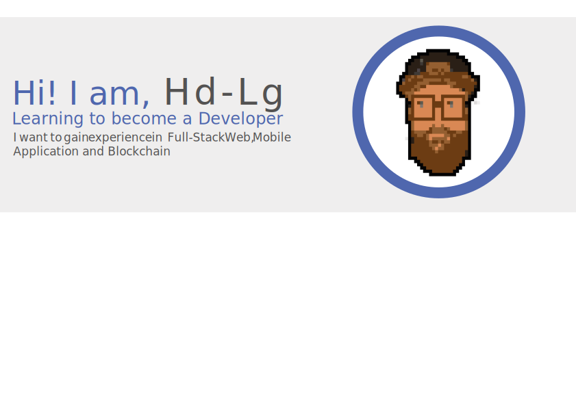

<h1> Hi 👋 </h1>

Training to become a React developper - after that, a full stack dev.
Maybe I'll dip my toes in Blockchain, seems very interesting and fun. And then conquer the world with my army of robots... or just be happy, sounds less stressing. :)

<h2> About Me </h2>

- Studied and obtain my master in 'Innovation and Technology's Management with a specialisation in Entrepreneurship'.

- Started some entrepreneurial projects (might as well apply what I learned) in real estate, deployment, management and monitoring of VPS for blockchain projects.

<h2>My Projects</h2>

<h2>Languages and Technologies I use</h2>
<!-- HTML5, CSS, JavaScript, TypeScript, Python, Sass, Bootsrap, Git, GitHub, Linux, Node.js, React, Firebase, VS Codem -->

<h2>Contact Me!</h2>
<a href='#' target='_blank'>Mail</a>
<a href='#' target='_blank'>Hd-Lg.com</a>

<h3> Some Stats </h3>

  
  
   
<!--
**Hd-Lg/Hd-Lg** is a ✨ _special_ ✨ repository because its `README.md` (this file) appears on your GitHub profile.

Here are some ideas to get you started:

- 🔭 I’m currently working on ...
- 🌱 I’m currently learning ...
- 👯 I’m looking to collaborate on ...
- 🤔 I’m looking for help with ...
- 💬 Ask me about ...
- 📫 How to reach me: ...
- 😄 Pronouns: ...
- ⚡ Fun fact: ...
-->
